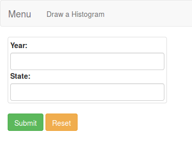
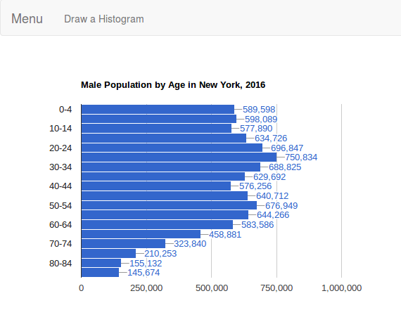

# ACS
 Spring Boot application for drawing histograms using data from the Census Bureau's API (requires a key).
 

 Enter year and state to get a histogram of population by age for the chosen data.

